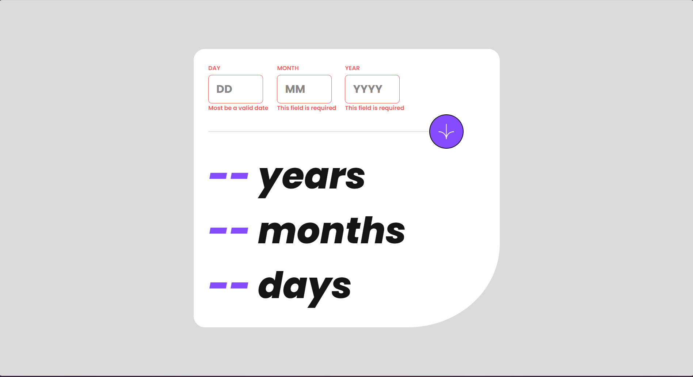
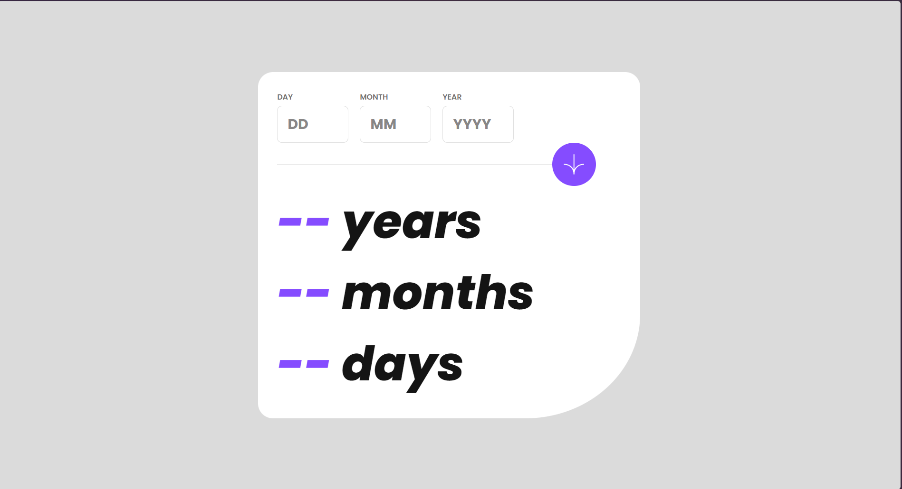
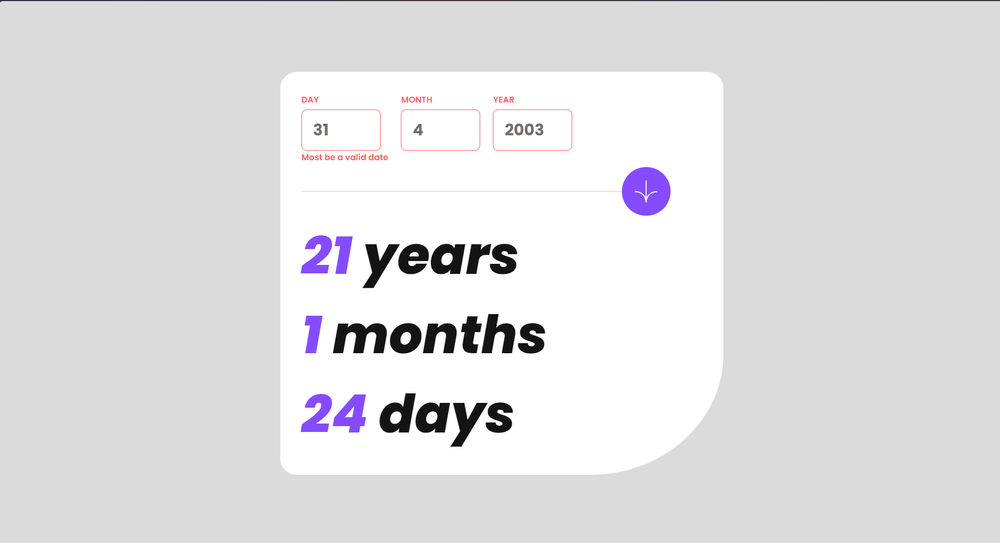
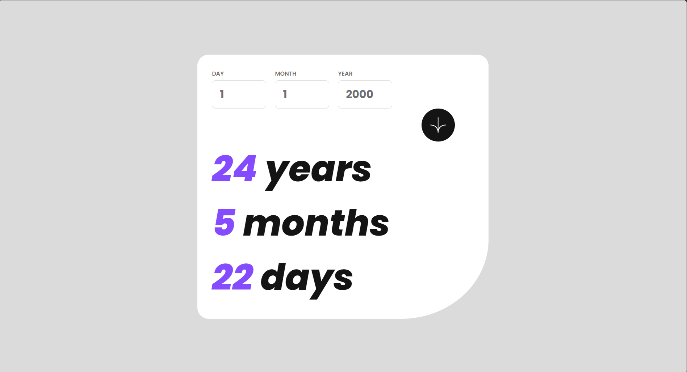
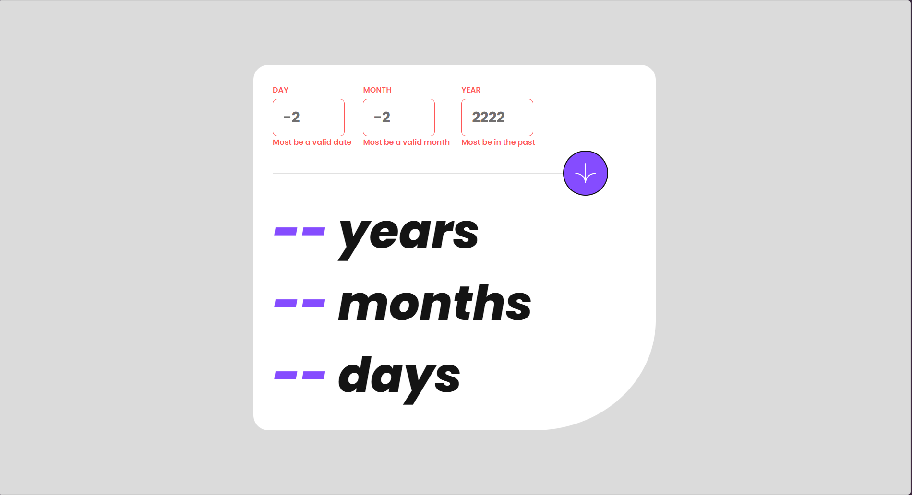

# Frontend Mentor - Age calculator app solution

This is a solution to the [Age calculator app challenge on Frontend Mentor](https://www.frontendmentor.io/challenges/age-calculator-app-dF9DFFpj-Q). Frontend Mentor challenges help you improve your coding skills by building realistic projects. 

## Table of contents

- [Overview](#overview)
  - [The challenge](#the-challenge)
  - [Screenshot](#screenshot)
  - [Links](#links)
- [My process](#my-process)
  - [Built with](#built-with)
- [Author](#author)
- [Acknowledgments](#acknowledgments)

## Overview

### The challenge

Users should be able to:

- View an age in years, months, and days after submitting a valid date through the form
- Receive validation errors if:
  - Any field is empty when the form is submitted
  - The day number is not between 1-31
  - The month number is not between 1-12
  - The year is in the future
  - The date is invalid e.g. 31/04/1991 (there are 30 days in April)
- View the optimal layout for the interface depending on their device's screen size
- See hover and focus states for all interactive elements on the page
- **Bonus**: See the age numbers animate to their final number when the form is submitted

### Screenshot

### Links

- Solution URL: [Add solution URL here](https://www.frontendmentor.io/solutions/age-calculator-app-with-sass-v2u-4WwdXn)
- Live Site URL: [Add live site URL here](https://age-calculator-app-phi-flame.vercel.app/)

## My process

### Built with

- Semantic HTML5 markup
- CSS custom properties
- Flexbox

## Author

- Website - [Forche Mbungai Francesco](https://mbungai-francesco.github.io/Portfolio/)
- Frontend Mentor - [@Mbungai-Francesco](https://www.frontendmentor.io/profile/Mbungai-Francesco)
- Github - [@Mbungai-Francesco](https://github.com/Mbungai-Francesco)
- Twitter - [@MbungaiF](https://www.twitter.com/MbungaiF)
- LinkedIn - [@Forche Mbungai Francesco Asongwe](https://www.linkedin.com/in/forche-mbungai-francesco-asongwe-4806a5293/)

## Acknowledgments

I thank God for the strength and resources he keeps sending my way.